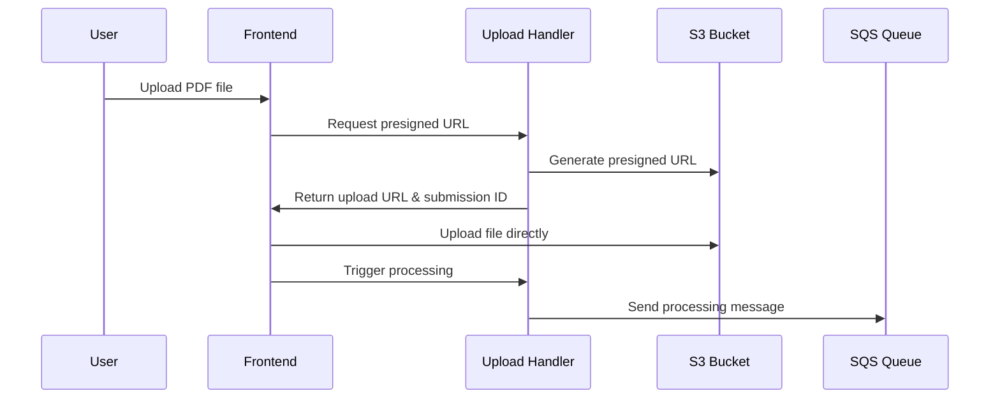
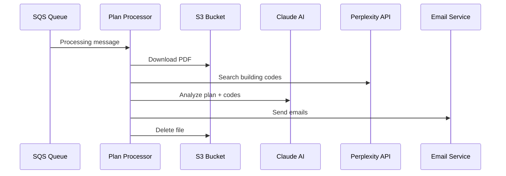

# AWS Architecture Guide

This document provides a comprehensive overview of CivicStream's AWS-based infrastructure for architectural plan review processing.

## Architecture Overview

CivicStream operates using a hybrid architecture:
- **Frontend**: Next.js application hosted on Vercel
- **Backend**: AWS serverless infrastructure (Lambda, S3, SQS, API Gateway)
- **AI Processing**: Anthropic Claude via AWS Lambda
- **Web Search**: Perplexity API for building code research

## Infrastructure Components

### AWS Services

| Service | Resource Name | Purpose |
|---------|--------------|---------|
| **S3** | `civicstream-plan-storage-{suffix}` | Temporary PDF storage with 24-hour lifecycle |
| **Lambda** | `upload-handler` | Manages S3 presigned URLs and triggers processing |
| **Lambda** | `plan-processor` | PDF analysis using Claude AI and email delivery |
| **SQS** | `plan-processing-queue` | Background job queue for asynchronous processing |
| **SQS** | `plan-processing-dlq` | Dead letter queue for failed processing attempts |
| **API Gateway** | HTTP API v2 | Public endpoints for frontend communication |
| **CloudWatch** | Log Groups | Logging and monitoring for all services |

### Lambda Functions

#### 1. Upload Handler (`upload-handler`)
- **Runtime**: Node.js 20.x
- **Memory**: 512MB
- **Timeout**: 30 seconds
- **Purpose**: 
  - Generate S3 presigned upload URLs
  - Trigger background processing via SQS
- **Endpoints**:
  - `POST /upload-handler` (action: 'get-upload-url')
  - `POST /upload-handler` (action: 'process-file')

#### 2. Plan Processor (`plan-processor`)
- **Runtime**: Node.js 20.x
- **Memory**: 3008MB (maximum)
- **Timeout**: 900 seconds (15 minutes)
- **Purpose**:
  - Download PDFs from S3
  - Extract text using pdf-parse
  - Analyze plans with Claude AI
  - Research building codes via Perplexity API
  - Send HTML emails via Nodemailer
  - Clean up S3 files

### Frontend Integration

The Next.js frontend uses a hardcoded AWS endpoint for development:

```typescript
const AWS_UPLOAD_HANDLER_ENDPOINT = 'https://v9cmp61l9d.execute-api.us-west-2.amazonaws.com/prod/upload-handler';
```

## Processing Workflow

### 1. File Upload Flow



### 2. Background Processing Flow



## Environment Configuration

### Lambda Environment Variables

```bash
# AI Services
ANTHROPIC_API_KEY=your_claude_api_key
PERPLEXITY_API_KEY=your_perplexity_api_key

# AWS Resources
S3_BUCKET_NAME=civicstream-plan-storage-xxxx
SQS_QUEUE_URL=https://sqs.us-west-2.amazonaws.com/account/queue-name

# Email Configuration
EMAIL_FROM=CivicStream Smart Routing <routing@civicstream.io>
EMAIL_HOST=smtp.gmail.com
EMAIL_USER=harper@civicstream.io
EMAIL_PASSWORD=tgmtkreuurpiyldx
EMAIL_SECURE=true
```

### Frontend Environment Variables

```bash
# Development endpoint (hardcoded in production)
NEXT_PUBLIC_AWS_UPLOAD_ENDPOINT=https://v9cmp61l9d.execute-api.us-west-2.amazonaws.com/prod/upload-handler
```

## Security & Permissions

### IAM Policies

1. **S3 Access**: Lambda functions can read, write, and delete objects in the plan storage bucket
2. **SQS Access**: Upload handler can send messages, plan processor can receive and delete messages
3. **CloudWatch**: All functions can write logs

### Security Features

- **S3 Presigned URLs**: Secure, time-limited file uploads
- **CORS Configuration**: Restricted origins for API access
- **Automatic Cleanup**: Files deleted after processing
- **Environment Variables**: Sensitive data stored securely
- **Dead Letter Queue**: Failed messages preserved for debugging

## Monitoring & Debugging

### CloudWatch Logs

All Lambda functions write logs to CloudWatch:
- `/aws/lambda/civicstream-upload-handler`
- `/aws/lambda/civicstream-plan-processor`
- `/aws/apigateway/civicstream-http-api`

### Error Handling

1. **Upload Handler**: Returns detailed error messages for validation failures
2. **Plan Processor**: Implements retry logic (3 attempts) with exponential backoff
3. **Dead Letter Queue**: Captures messages that fail after all retries
4. **Default Responses**: Fallback response when Claude processing fails

### Common Issues & Solutions

| Issue | Symptoms | Solution |
|-------|----------|----------|
| **Large File Upload** | Timeout errors | Check file size limits (50MB frontend, 512MB AWS) |
| **Claude API Failures** | Processing errors | Check API key and rate limits |
| **Email Delivery Failures** | Missing notifications | Verify SMTP credentials and settings |
| **S3 Access Errors** | Upload failures | Check IAM permissions and bucket policy |

## Deployment

### Terraform Infrastructure

Infrastructure is managed in `../aws-infrastructure/`:

```bash
# Initialize Terraform
cd ../aws-infrastructure
terraform init

# Plan deployment
terraform plan

# Deploy infrastructure
terraform apply
```

### Lambda Function Updates

Lambda functions are deployed using ZIP files:
- `lambda-functions/upload-handler.zip`
- `lambda-functions/plan-processor.zip`

### Frontend Deployment

The Next.js frontend is deployed to Vercel with environment variables configured in the Vercel dashboard.

## Cost Optimization

1. **S3 Lifecycle**: Automatic deletion after 24 hours
2. **Lambda Memory**: Right-sized based on function requirements
3. **SQS Visibility Timeout**: Optimized to prevent duplicate processing
4. **CloudWatch Retention**: 14-day log retention

## Performance Metrics

| Metric | Target | Current Performance |
|--------|--------|-------------------|
| **Upload Response Time** | < 30 seconds | 15-30 seconds |
| **Processing Time** | < 15 minutes | 2-10 minutes |
| **Email Delivery** | < 1 minute | 30-60 seconds |
| **S3 Cleanup** | Immediate | After email delivery |

## Troubleshooting

### Debug Steps

1. **Check CloudWatch Logs**: Look for error messages and stack traces
2. **Verify SQS Messages**: Check if messages are in the queue or DLQ
3. **Test API Endpoints**: Use curl or Postman to test directly
4. **Monitor S3 Bucket**: Verify files are being uploaded and deleted
5. **Check Email Logs**: Confirm SMTP authentication and delivery

### Emergency Procedures

1. **High Error Rate**: Check dead letter queue and CloudWatch logs
2. **API Downtime**: Verify API Gateway and Lambda function status
3. **Storage Issues**: Check S3 bucket permissions and lifecycle policies
4. **Email Failures**: Verify SMTP credentials and service status